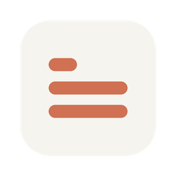

# Claude Usage Widget

A macOS menu bar widget for **Apple Silicon** that shows your Claude.ai usage in real time.

**Unofficial** — not affiliated with Anthropic.

| Name | Used for |
|------|----------|
| **Claude Usage Widget** | Project name |
| **Claude Meter** | App name in the menu bar, Dock, and `/Applications` |



## Features

- Session and weekly usage with progress bars and countdown timers
- Auto-refresh (configurable), usage history graph, and usage alerts
- Dark/light themes, always-on-top window, menu bar stats
- Launch at login, per-display window position, battery saver mode
- Session credentials stored in the macOS Keychain

## Setup

**Requirements:** macOS on Apple Silicon, Node.js 18+, npm 9+

```bash
cd claude-usage-widget
npm install
npm start
```

### Optional: build a local app

```bash
npm run build:mac
```

Output: `dist/Claude Meter-{version}-macOS-arm64.dmg`

1. Open the DMG and drag **Claude Meter** to **Applications**
2. **Right-click → Open** the first time (unsigned build)

## Usage

1. Launch with `npm start`, or open **Claude Meter** from Applications
2. Click **Sign In** and complete login in the sign-in window
3. Usage appears automatically

**Controls:** drag the title bar to move; refresh, graph, settings, minimize, and close in the toolbar.

**Menu bar:** click to show/hide the widget; right-click for Show, Refresh, Settings, Sign Out, and Quit. **⌘⇧U** toggles the window.

## Settings

Launch at startup, hide from Dock, menu bar stats, battery saver, theme, thresholds, alerts, time/date formats, and compact mode.

## Privacy

- Credentials, settings, and usage history stay on your Mac
- Network traffic goes to claude.ai (and OAuth providers during login only)
- Sign out clears session data and cookies

This app holds a Claude session key with the same access as your browser session. Only run code you trust.

## Troubleshooting

| Issue | Fix |
|-------|-----|
| Login keeps appearing | Re-authenticate via Sign In |
| Not updating | Check network; click refresh |
| Won't open after `build:mac` | Right-click **Claude Meter** → Open |
| Build errors | `rm -rf node_modules && npm install` |

## Uninstall

1. Quit the app
2. If installed from a DMG, drag **Claude Meter** from Applications to Trash
3. Optional: `rm -rf ~/Library/Application\ Support/claude-usage-widget`

## License

[MIT License](LICENSE)
