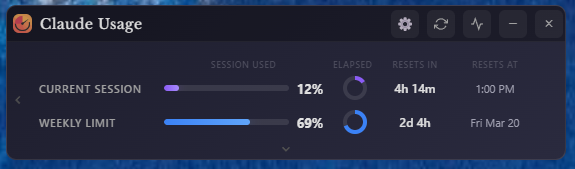

# Claude Usage Widget

A standalone desktop widget for **macOS on Apple Silicon** (M1/M2/M3/M4) that displays your Claude.ai usage statistics in real time.

**Unofficial** — not affiliated with Anthropic. Forked from [SlavomirDurej/claude-usage-widget](https://github.com/SlavomirDurej/claude-usage-widget).



---

## Features

- **Real-time usage tracking** — Session and weekly limits
- **Visual progress bars** — Configurable warning thresholds
- **Countdown timers** — Time remaining in the current session window
- **Auto-refresh** — Updates every 5 minutes (configurable)
- **Usage history graph** — Toggleable 7-day chart
- **Currency support** — Extra usage in €, £, or $
- **Dark and light themes** — Plus live system theme sync
- **Always on top** — Stays visible across workspaces
- **Menu bar stats** — Dual or single icon mode; optional macOS template icons
- **Dock integration** — Session % badge when visible; optional hide from Dock
- **Native macOS menus** — Standard app menu, **⌘,** settings, **⌘R** refresh, **⌘⇧U** toggle window
- **Usage alerts** — Notifications with Show Widget and Snooze actions
- **Battery saver** — Doubles auto-refresh interval on battery power
- **Per-display position** — Remembers window placement per monitor
- **Launch at login** — macOS Login Items
- **Secure storage** — Session credentials in the macOS Keychain

---

## Installation

### Download (Apple Silicon)

1. Download the latest `*-macOS-arm64.dmg` from [Releases](https://github.com/mctatge-alt/claude-usage-widget/releases)
2. Open the DMG and drag the app to **Applications**
3. Launch **Claude Usage Widget** from Applications

**First launch:** Signed, notarized builds should open normally. If macOS shows an unidentified-developer warning, **Right-click the app → Open** and confirm once. Only use builds downloaded from the official Releases page above.

### Homebrew (optional)

See [HOMEBREW_SUBMISSION.md](HOMEBREW_SUBMISSION.md) for the formula template.

### Build from source

**Requirements:** macOS on Apple Silicon, Node.js 18+

```bash
git clone https://github.com/mctatge-alt/claude-usage-widget.git
cd claude-usage-widget
npm install
npm start
```

Build a DMG (requires signing credentials — see [MACOS_CODE_SIGNING.md](MACOS_CODE_SIGNING.md)):

```bash
npm run build:mac
```

Output: `dist/Claude-Meter-{version}-macOS-arm64.dmg` (product name in `package.json`)

---

## Usage

1. Launch the widget
2. Click **Login to Claude** — a browser window opens for claude.ai
3. Sign in; the widget captures your session automatically
4. Usage data appears immediately

**Controls:** drag the title bar to move; refresh, graph, settings, minimize (−), and close (×) in the toolbar.

**Menu bar:** click to show/hide the widget; right-click for Show, Refresh, Settings, Sign Out, and Quit. Use the app menu or **⌘⇧U** to toggle the window.

---

## Settings

- **Launch at startup** — Login Items
- **Hide from Dock** — Menu bar only (pairs with Show Tray Stats)
- **Show tray stats** — Menu bar percentage icons (dual or single layout)
- **Template menu bar icons** — Monochrome icons that follow light/dark menu bar
- **Battery saver** — Slower refresh on battery
- **Theme, thresholds, alerts, time/date formats, compact mode**

---

## Privacy & security

- **Local only** — Session credentials (Keychain), settings, and usage history stay on your Mac
- **No third-party servers** — Network traffic goes to claude.ai (and OAuth providers during login only)
- **Logout** clears session data and cookies
- **Open source** — Publishing source code does not expose your data; each user’s credentials live only on their machine

**Before installing:** This app holds a Claude session key with the same access as your browser session. Only install from the official Releases page or a build you compiled yourself.

**Verifying downloads:** Compare the DMG SHA-256 checksum against the release notes when provided. See [SECURITY.md](SECURITY.md) for details and vulnerability reporting.

---

## Troubleshooting

| Issue | Fix |
|-------|-----|
| Login keeps appearing | Re-authenticate via Login to Claude |
| Not updating | Check network; click refresh |
| Won't open after download | Right-click app → Open (signed build from official Releases only) |
| Build errors | `rm -rf node_modules && npm install` |

---

## License

[MIT License](LICENSE) — see file for copyright holders (original author and fork maintainer).

*Built with Electron · [Releases](https://github.com/mctatge-alt/claude-usage-widget/releases)*
